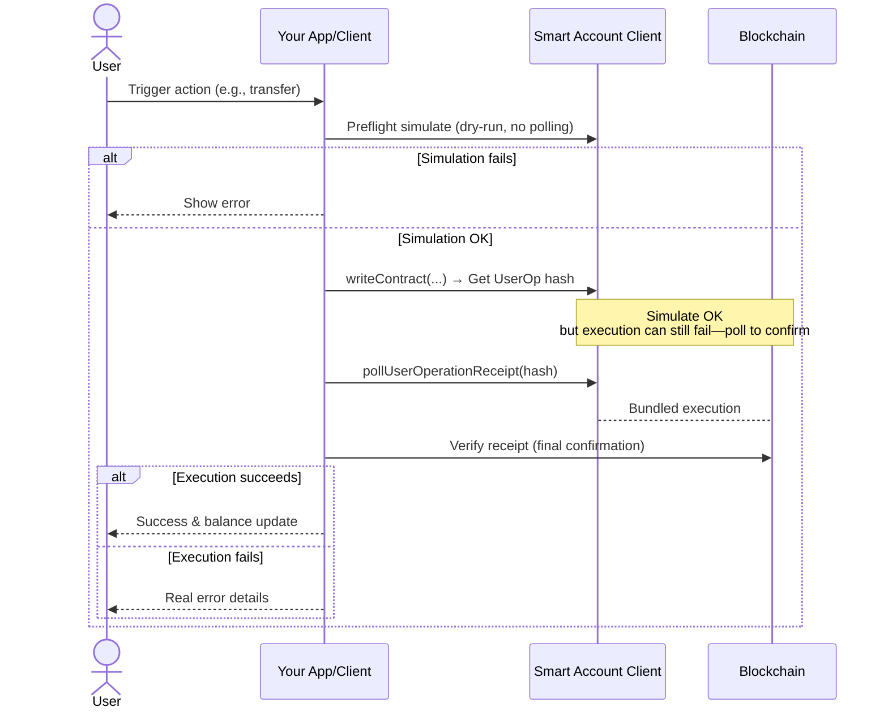

## Smart Account Simulation Guide

### Client Setup
Use the provided helpers:
- `createClients(embeddedWallet, chain)`: Gets public and owner clients.
- `createSmartAccount(publicClient, owner, chain)`: Builds the smart account.
- `createSmartAccountClientWithPaymaster(account, chain)`: Creates the client with built-in paymaster support (handles gas sponsorship).

### Client Usage Flow
1. Set up your embedded wallet and chain, then create the smart account client as above.

2. **Preflight Simulation**: Before any action, simulate to catch issues early (this is a dry-run—no network submission or polling needed).
   - For ERC-20 transfers: `preflightErc20Transfer(publicClient, account.address, tokenAddress, to, amount)`
   - Returns `{ ok: true }` or `{ ok: false, reason: 'error message' }`.
   - If not OK, show the reason to the user and stop.

3. **Execute Action**: If simulation passes, use the smart account client directly:
   - `saClient.writeContract({ address: target, abi: ..., functionName: 'transfer', args: [...] })`
   - The client handles bundling, paymaster, and submission automatically—no direct bundler interaction needed.
   - This returns a UserOp hash for the submitted operation.
   - **Note**: Even with a successful sim, execution might still fail due to network changes—always follow with polling.

4. **Monitor Status** (after execution): Use `pollUserOperationReceipt(uoHash, callbacks)` to track the actual UserOp progress and confirm on-chain results.
   - Pass state setters (e.g., setTxStatus, setFailureReason) in callbacks.
   - It polls until confirmed, updates UI, and refreshes balances on success.
   - For final verification: `checkTransactionStatus(txHash, callbacks)` (txHash comes from polling).

### Client Tips
- Always simulate from the smart account's address (`account.address`).
- The client abstracts account abstraction details; verify outcomes via polling and logs.
- No need to manage infrastructure details—helpers handle submission and sponsorship for you.
- Simulation doesn't trigger polling—it's just a pre-check. Poll only the UserOp hash from execution to verify real success/failure (sim OK doesn't guarantee execution OK).

### Simple Client Flow

